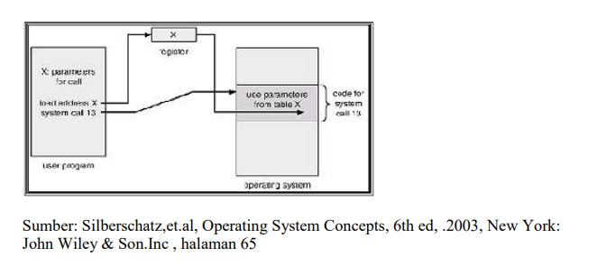
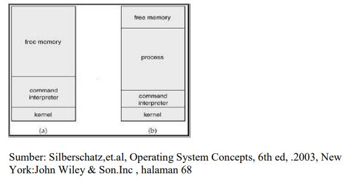
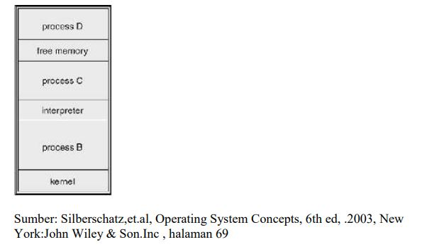
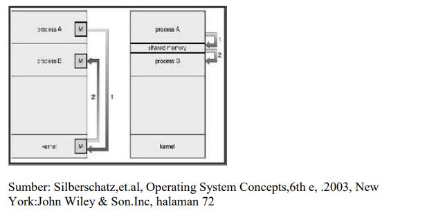
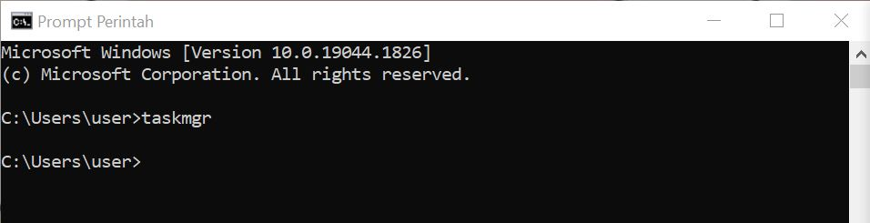
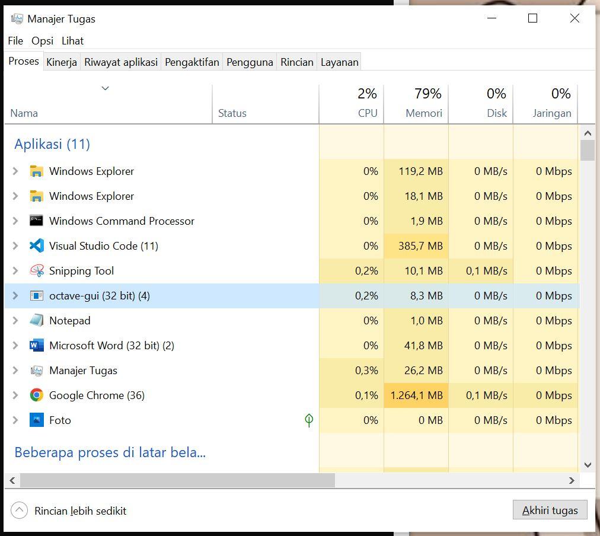
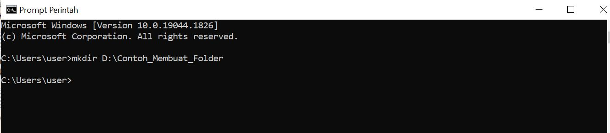
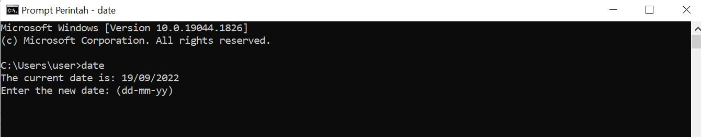

### Nama        : ALFIKA NURFADIA
### NIM         : 2110131220016
---
# Layanan Sistem Operasi, Layanan Sistem Operasi & Sistem Program, dan System Calls

## Layanan Sistem Operasi

Layanan sistem operasi dirancang untuk membuat pemrograman menjadi lebih mudah. 

1. Pembuatan Program
    Sistem operasi menyediakan berbagai fasilitas yang membantu programer dalam membuat program seperti editor. Walaupun bukan bagian dari sistem operasi, tapi layanan ini diakses melalui sistem operasi.  
2. Eksekusi Program
    Sistem harus bisa me-load program ke memori, dan menjalankan program 
    tersebut. Program harus bisa menghentikan pengeksekusiannya baik secara 
    normal maupun tidak (ada error) 
3. Operasi I/O
    Program yang sedang dijalankan kadang kala membutuhkan I/O. Untuk efisiensi 
    dan keamanan, pengguna biasanya tidak bisa mengatur peranti I/O secara 
    langsung, untuk itulah sistem operasi harus menyediakan mekanisme dalam 
melakukan operasi I/O. 
4. Manipulasi Sistem Berkas
    Program harus membaca dan menulis berkas, dan kadang kala juga harus 
    membuat dan menghapus berkas. 
5. Komunikasi
    Kadang kala sebuah proses memerlukan informasi dari proses yang lain. Ada dua 
    cara umum dimana komunikasi dapat dilakukan. Komunikasi dapat terjadi antara 
    proses dalam satu komputer, atau antara proses yang berada dalam komputer yang 
    berbeda, tetapi dihubungkan oleh jaringan komputer. Komunikasi dapat dilakukan 
    dengan pembagian memori(penggunaan bersama, share-memory)atau messagepasssing, dimana sejumlah informasi dipindahkan antara proses oleh sistem 
    operasi. 
6. Deteksi Error
    Sistem operasi harus selalu waspada terhadap kemungkinan error. Error dapat 
    terjadi di CPU dan memori perangkat keras, I/O, dan di dalam program yang 
    dijalankan pengguna. Untuk setiap jenis error sistem operasi harus bisa 
    mengambil langkah yang tepat untuk mempertahankan jalannya proses komputasi.

Disamping pelayanan diatas, sistem operasi juga menyediakan layanan lain. Layanan ini 
bukan untuk membantu pengguna tapi lebih pada mempertahankan efisiensi sistem itu 
sendiri. Layanan tambahan itu yaitu : 

1. Alokasi Sumber Daya
    Ketika beberapa pengguna menggunakan sistem atau beberapa program 
    dijalankan secara bersamaan, sumber daya harus dialokasikan bagi masingmasing pengguna dan program tersebut. 
2. Accounting
    Kita menginginkan agar jumlah pengguna yang menggunakan sumber daya, dan 
    jenis sumber daya yang digunakan selalu terjaga. Untuk itu maka diperlukan suatu 
    perhitungan dan statistik. Perhitungan ini diperlukan bagi seseorang yang ingin 
    merubah konfigurasi sistem untuk meningkatkan pelayanan. 
3. Proteksi
    Layanan proteksi memastikan bahwa segala akses ke sumber daya terkontrol. Dan 
    tentu saja keamanan terhadap gangguan dari luar sistem tersebut. Keamanan bisa 
    saja dilakukan dengan terlebih dahulu mengidentifikasi pengguna. Ini bisa 
    dilakukan dengan meminta passsword bila ingin menggunakan sumber daya.

## System Program

System program menyediakan lingkungan yang memungkinkan pengembangan program 
dan eksekusi berjalan dengan baik. 

Dapat dikategorikan :

- Manajemen/manipulasi Berkas
    Membuat, menghapus, copy, rename, print, memanipulasi berkas dan direktori 
- Informasi status
    Beberapa program meminta informasi tentang tanggal, jam, jumlah memori dan 
    disk yang tersedia, jumlah pengguna dan informasi lain yang sejenis. 
- Modifikasi berkas
    membuat berkas dan memodifikasi isi berkas yang disimpan pada disk atau tape. 
- Pendukung bahasa        pemrograman 
    kadang kala kompilator, assembler, dan interpreter dari bahasa pemrograman 
    diberikan kepada pengguna dengan bantuan sistem operasi. 
- Loading dan eksekusi program
    Ketika program di-assembly atau di-compile, program tersebut harus di-load ke 
    dalam memori untuk dieksekusi. Untuk itu sistem harus menyediakan absolute 
    loaders, relocatable loaders, linkage editors,dan overlay loaders
- Komunikasi
    menyediakan mekanisme komunikasi antara proses, pengguna, dan sistem 
    komputer yang berbeda. Sehingga pengguna bisa mengirim pesan, menelusuri 
    halaman web, mengirim e-mail, atau mentransfer berkas.

Umumnya sistem operasi dilengkapi oleh system-utilities atau program aplikasi yang di 
dalamnya termasuk web browser, word prossesor dan format teks, sistem database, 
games. System program yang paling penting adalah command interpreter (mengambil 
dan menerjemahkan user-specified command selanjutnya).

## Struktur Sistem

Sebuah sistem yang besar dan kompleks seperti sistem operasi modern harus diatur 
dengan cara membagi task kedalam komponen-komponen kecil agar dapat berfungsi 
dengan baik dan mudah dimodifikasi. Pada bab ini, kita akan membahas cara komponenkomponen ini dihubungkan satu sama lain. Menurut Avi Silberschatz, Peter Galvin, dan 
Greg Gagne, ada tiga cara yaitu:
- Struktur Sederhana
- Pendekatan Terlapis
- Mikrokernel

Sedangkan menurut William Stallings, kita bisa memandang sistem sebagai seperangkat 
lapisan. Tiap lapisan manampilkan bagian fungsi yang dibutuhkan oleh sistem operasi. 
Bagian yang terletak pada lapisan yang lebih rendah akan menmpilkan fungsi yang lebih 
primitif dan menyimpan detail fungsi tersebut.

## System Calls

Biasanya tersedia sebagai instruksi bahasa rakitan. Beberapa sistem mengizinkan system 
calls dibuat langsung dari program bahasa tingkat tinggi. Beberapa bahasa pemrograman 
(contoh : C, C++) telah didefenisikan untuk menggantikan bahasa rakitan untuk sistem 
pemrograman. 

Tiga metode umum yang digunakan dalam memberikan parameter kepada sistem operasi 
- Melalui register
- Menyimpan parameter dalam blok atau tabel pada memori dan alamat blok 
tersebut diberikan sebagai parameter dalam register
- Menyimpan parameter (push) ke dalam stack (oleh program), dan melakukan pop 
off pada stack (oleh sistem operasi)

**Memberikan parameter melalui tabel**

### Jenis System Calls

1. Kontrol Proses
    System calls yang berhubungan dengan kontrol proses antara lain ketika 
    penghentian pengeksekusian program. Baik secara normal (end) maupun tidak 
    normal (abort). Selama proses dieksekusi kadang kala diperlukan untuk meload
    atau mengeksekusi program lain, disini diperlukan lagi suatu system calls. Juga 
    ketika membuat suatu proses baru dan menghentikan sebuah proses. Ada juga 
    system calls yang dipanggil ketika kita ingin meminta dan merubah atribut dari 
    suatu proses. x

    MS-DOS adalah contoh dari sistem single-tasking. MS-DOS menggunakan 
    metode yang sederhana dalam menjalankan program dan tidak menciptakan 
    proses baru. Program di-load ke dalam memori, kemudian program dijalankan. 

    **Eksekusi MS-Dos**
    

    Barkeley Unix adalah contoh dari sistem multi-tasking. Command interpereter
    masih tetap bisa dijalankan ketika program lain dieksekusi. 

    **Multi program pada *Unix***
    
2. Manajemen Berkas
    System calls yang berhubungan dengan berkas sangat diperlukan. Seperti ketika 
    kita ingin membuat atau menghapus suatu berkas. Atau ketika ingin membuka 
    atau menutup suatu berkas yang telah ada, membaca berkas tersebut, dan menulis 
    berkas itu.System calls juga diperlukan ketika kita ingin mengetahui atribut dari 
    suatu berkas atau ketika kita juga ingin merubah atribut tersebut. Yang termasuk 
    atribut berkas adalah nama berkas, jenis berkas, dan lain-lain 
    Ada juga system calls yang menyediakan mekanisme lain yang berhubungan 
    dengan direktori atau sistim berkas secara keseluruhan. Jadi bukan hanya 
    berhubungan dengan satu spesifik berkas. Contohnya membuat atau menghapus 
    suatu direktori, dan lain-lain 
3. Manajemen Peranti
    Program yang sedang dijalankan kadang kala memerlukan tambahan sumber 
    daya. Jika banyak pengguna yang menggunakan sistem dan jika diperlukan 
    tambahan sumber daya maka harus meminta peranti terlebih dahulu. Dan setelah 
    selesai penggunakannnya harus dilepaskan kembali. Ketika sebuah peranti telah 
    diminta dan dialokasikan maka peranti tersebut bisa dibaca, ditulis, atau 
    direposisi. 
4. Informasi Maintenance
    Beberapa system calls disediakan untuk membantu pertukaran informasi antara 
    pengguna dan sistem operasi. Contohnya system calls untuk meminta dan 
    mengatur waktu dan tanggal. Atau meminta informasi tentang sistem itu sendiri, 
    seperti jumlah pengguna, jumlah memori dan disk yang masih bisa digunakan, 
    dan lain-lain. Ada juga system calls untuk meminta informasi tentang proses yang 
    disimpan oleh sistem dan system calls untuk merubah ( reset ) informasi tersebut. 
5. Komunikasi
    Dua model komunikasi
    - *message-passing*
        pertukaran informasi dilakukan melalui fasilitas komunikasi antar proses 
        yang disediakan oleh sistem operasi. 
    - shared-memory
        Proses menggunakan memori yang bisa digunakan oleh berbagai proses 
        untuk pertukaran informasi dengan membaca dan menulis data pada 
        memori tersebut.
    
    **Mekanisme Komunikasi**
    
      Dalam message-passing, sebelum komunikasi dapat dilakukan harus dibangun dulu sebuah koneksi.Untuk itu diperlukan suatu system calls dalam pengaturan koneksi tersebut, baik dalam menghubungkan koneksi tersebut maupun dalam memutuskan koneksi tersebut ketika komunikasi sudah selesai dilakukan. Juga diperlukan suatu system calls untuk membaca dan menulis pesan( message ) agar pertukaran informasi dapat dilakukan.

---
## Komponen Sistem Operasi
1. Manajemen Proses
    
    Manajemen proses merupakan proses yang dilakukan atau yang sedang berjalan misal membuka aplikasi Microsoft word, adobe primiere dll dan pada saat dilakukan maka prosessor mengerjakan dalam waktu yang bersamaan. Tapi kenapa tidak terjadi tabrakan data pada dilakukan secara bersamaan. Karena disini sistem operasi bekerja dimana sebagai pengolah kerja prosessor sehingga tidak mengakibatkan terjadinya tabrakan data.
2. Manajemen Memory Utama
    
    Manajemen memory utama maksudnya disini tempat sementara data atau informasi kemudian diteruskan ke prosessor supaya tidak terjadi tabrakan data. Nah disini sistem operasi juga bertanggung jawab pada aktivitas yang berkaitan dengan memory seperti :

    - Bisa memilih program yang hendak diload ke dalam memori
    - Bisa mengalokasikan ruang memorinya sesuai kebutuhan
    - Bisa menjaga track dari memori ketika sedang digunakan
3. Manajemen File
    
    File merupakan berkas bisa berupa data misalnya file video, music, dan gambar. Sistem operasi perlu mengatur aktivitas yang berkaitan dengan file. File dapat mempunyai struktur yang bersifat hierarkis (direktori, volume, dll). Sistem operasi memberikan tanggapan atas manajemen file untuk aktifitas-aktifitas berikut:

    - Pembuatan dan penghapusan file,
    - Pembuatan dan penghapusan direktori,
    - Mendukung primitif-primitif manipulasi file dan direktori,
    - Pemetaan file dalam secondnary storage,
    - Backup file dalam media yang stabil (non-volatile).
    
 ## Komponen Layanan Sistem Operasi & Sistem Program 

## Komponen Sistem Call
1. System call manajemen proses
    System Call untuk manajemen proses diperlukan untuk mengatur proses-proses yang sedang berjalan. Kita dapat melihat penggunaan system calls untuk manajemen Oproses pada Sistem Operasi Unix.

    Contoh:

    Perintah taskmgr mempunyai fungsi untuk memanggil Task Manager melalui CMD.Di dalam Task Manager, kamu dapat melihat beberapa data seperti penggunaan CPU, Memory, Disk, serta Network. Kamu juga bisa menutup aplikasi yang sedang berjalan atau mengalami freeze atau error melalui Task Manager.

    
    
 

2. System call manajemen berkas
    System calls yang berhubungan dengan berkas sangat diperlukan. Seperti ketika kita ingin membuat atau menghapus suatu berkas. Atau ketika ingin membuka atau menutup suatu berkas yang telah ada, membaca berkas tersebut, dan menulis berkas itu. 

    Contoh: 
    
    Membuat File atau Folder 
    Untuk membuat folder, ketik nama folder dengan lokasi dimana anda ingin membuat folder. Berikut adalah perintahnya 
    > mkdir < folder name with path >

    contoh  
    >    mkdir D:\Contoh_Membuat_Folder

    
    
 

3. System call pemeliharaan informasi
    Beberapa system calls di sediakan untuk membatu pertukaran informasi antara pengguna dan sistem operasi. Contohnya system calls untuk meminta dan mengatur waktu dan tanggal.

    Contoh:

    Dengan menggunakan fungsi date, kamu bisa menampilkan tanggal pada layar cmd. Selain itu, kamu juga bisa mengatur ulang tanggal pada PC kamu jika belum sesuai.

        

